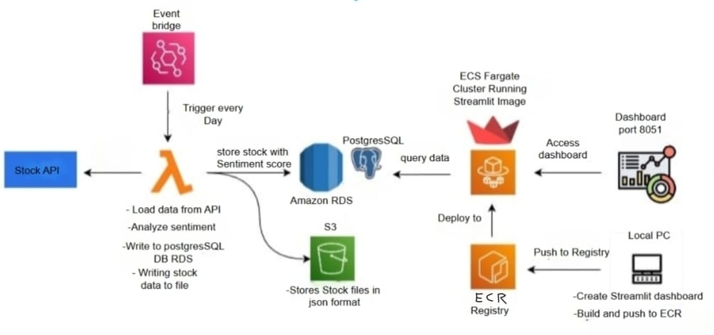

# 📈 Stock Sentiment Analysis Pipeline

This project is an automated data pipeline that fetches stock-related news from an API, analyzes the sentiment, stores it in a database, and visualizes the results through a Streamlit dashboard hosted on AWS ECS Fargate.

---

## 🧠 Project Overview

The pipeline performs the following tasks:

- **Daily Scheduled Fetching** using Amazon EventBridge
- **Serverless Processing** via AWS Lambda:
  - Loads stock data from a third-party API(Apple)
  - Analyzes the sentiment of news headlines
  - Writes results to both Amazon RDS (PostgreSQL) and Amazon S3
- **Data Storage:**
  - Structured data with sentiment scores → stored in Amazon RDS
  - Raw news data in JSON format → stored in Amazon S3
- **Streamlit Dashboard:**
  - Built locally
  - Dockerized and pushed to Amazon ECR
  - Deployed on ECS Fargate to run the dashboard
  - Dashboard available on **port 8051**

---

## 🗂️ Architecture Diagram



---

## 🚀 Technologies Used

- **AWS Lambda** – Serverless data processing
- **Amazon EventBridge** – Task scheduler
- **Amazon RDS (PostgreSQL)** – Structured data storage
- **Amazon S3** – Raw file storage
- **Amazon ECS Fargate** – Serverless container hosting
- **Amazon ECR** – Docker image registry
- **Streamlit** – Interactive data dashboard
- **Docker** – Containerization
- **Python** – Programming language for Lambda and dashboard

---

## 📊 Dashboard

The final dashboard is a Streamlit application that provides a visual summary of:

- Stock sentiment trends
- Volume of news articles
- Historical data comparisons

Accessible via `http://<your-domain-or-ecs-ip>:8051`

---

## 🛠️ Setup Instructions

1. Clone the repository:
   ```bash
   git clone https://github.com/your-username/stock-sentiment-pipeline.git
   cd stock-sentiment-pipeline
# stock-analysis
